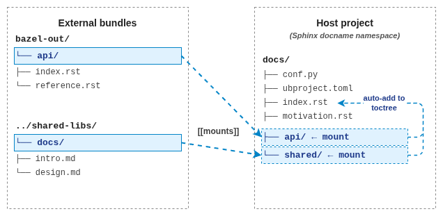

sphinx-mounts
=============

Mount external source trees into a Sphinx build **without copying or
symlinking**. The sources stay where they live; Sphinx reads them in place
under a configured docname prefix. Any format Sphinx knows how to parse
is supported — ``.rst`` out of the box, ``.md`` via
`myst-parser <https://myst-parser.readthedocs.io/>`__, plus anything else
a parser extension registers.

         directory outside the docs folder) appear in the host Sphinx
         project as virtual mount slots (docs/api/, docs/shared/) declared
         by [[mounts]] entries in ubproject.toml. A second arrow shows
         ubproject.toml driving the toctree attachment in index.rst.
   :align: center

   ``[[mounts]]`` entries in ``ubproject.toml`` map external directories
   onto docname slots in the host project. Those slots (``docs/api/``,
   ``docs/shared/``) do **not** exist on disk — sphinx-mounts populates
   them virtually and the host's ``index.rst`` toctree attaches them into
   the build.

Use cases:

- **Build-system-generated docs** (Bazel, Buck2, Pants) where outputs land
  in directories outside ``srcdir`` and you do not want a staging step.
- **Mono-repo doc bundles** owned by different teams and consumed by a
  host project.
- **Generated API references** produced by a sibling tool whose output is
  pure RST.
- **Distributed Markdown files** living next to the code they document —
  ``README.md`` files in each subpackage of a monorepo, design notes in
  sibling repositories, release notes generated under ``dist/`` — pulled
  into a single Sphinx documentation build without copying. Works as
  soon as ``myst_parser`` is loaded; see :ref:`source-formats`.

.. note::

   **Beta software.** sphinx-mounts is in early beta. The configuration
   shape, mount semantics, and edge-case behavior may still change before
   ``1.0``. Feedback on the mount mechanism — what works, what surprises
   you, what is missing — is very much appreciated; please open an issue
   at `github.com/useblocks/sphinx-mounts/issues
   <https://github.com/useblocks/sphinx-mounts/issues>`__.

.. toctree::
   :maxdepth: 2
   :caption: Contents

   motivation
   installation
   configuration
   usage
   integration
   bazel
   changelog

.. _related-projects:

Related projects
----------------

sphinx-mounts is part of the `useblocks`_ documentation tooling
ecosystem. The pieces are designed to be used independently or
together; the shared ``ubproject.toml`` convention lets a single
declarative file drive all of them.

- `Sphinx-Needs`_ — requirements management and traceability inside
  Sphinx. Declares its config under the ``[needs]`` table in
  ``ubproject.toml``.
- `sphinx-codelinks`_ — bidirectional source-to-doc traceability via
  one-line comments. Declares its config under the ``[codelinks]``
  table.
- `ubCode`_ — the language server that reads ``ubproject.toml`` and
  provides validation, hover, and cross-reference resolution for the
  whole stack inside the editor.
- `bazel-drives-sphinx`_ — a heavier Bazel-driven companion to
  sphinx-mounts; see :doc:`bazel` for a side-by-side comparison.
- `needs-config-writer`_ — bridges dynamic Python / Bazel-managed
  configuration with the static ``ubproject.toml`` that sphinx-mounts
  and ubCode read. Useful when the mount list itself needs to be
  produced by the build system rather than hand-written.
- `sphinx-collections`_ — a more general, multi-driver alternative for
  assembling external content into a Sphinx project (copy, symlink,
  git clone, jinja, …). sphinx-mounts is the lighter, narrower
  approach when the only thing you need is "read files in place from
  a known directory"; see :ref:`vs-sphinx-collections` for the
  side-by-side.
